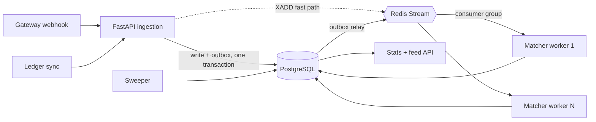

# LedgerLoop

A payment reconciliation engine. It ingests two independent transaction streams — a
payment gateway's webhook feed and a merchant's internal ledger — matches them
asynchronously, and flags every break a human needs to look at.

Every number the stats API reports is verifiable against ground truth injected by the
load generator. That is the point of the project: not that it reconciles, but that you
can prove it reconciled correctly.

---

## Live demo

| | |
|---|---|
| Dashboard | <https://ledger-loop-ivory.vercel.app> |
| API docs | <https://ledgerloop-api.onrender.com/docs> |

Both halves run on free tiers, which shapes what you will see. The API sleeps after
15 minutes with no traffic, so the first request after a quiet period pays a cold
start of roughly a minute — the dashboard pings `/health` on load to start that clock
while you are still reading the landing page. The matcher runs *inside* the API
process there (`LEDGERLOOP_EMBED_WORKER`), because Render has no free background
worker; see [Deploy](#deploy) for what that costs.

Opening it puts you in a **sandbox tenant of your own** — your uploads and generated
runs are yours alone, and they are deleted 24 hours after you stop touching them. An
account key switches the whole dashboard to a real account; see
[The dashboard](#the-dashboard).

---

## The problem

A merchant's ledger and their gateway's webhook feed never agree in real time. Webhooks
arrive out of order, retry, and duplicate. Clocks drift between systems. Amounts differ
by rounding or fees. Some transactions simply never show up on one side.

Somebody has to answer, continuously: **which payments are settled, which are broken,
and how broken?** Doing it with a nightly batch job means discovering a payment gap
sixteen hours late. LedgerLoop answers it as the events arrive.

The hard part is not the matching rules. It is doing them exactly once under retries,
concurrent workers, and at-least-once message delivery.

## Architecture



Ingestion returns `202` as soon as the row is durable. Matching happens in a separate
process, so a slow match never slows down a webhook response — and the matcher scales
independently of the API.

### Why these pieces

**Redis Streams with consumer groups, not pub/sub.** Pub/sub drops messages that arrive
while no consumer is connected, which makes a worker restart a data-loss event. Streams
persist, and a consumer group gives at-least-once delivery with per-consumer
acknowledgement — so `docker compose up --scale worker=3` coordinates three matchers
with no code change and no double-processing.

**A transactional outbox, not a bare `XADD`.** Writing the row to Postgres and
publishing to Redis are two systems; without an outbox, a crash between them loses the
event silently. The API writes the row *and* the outbox record in one transaction, and a
relay drains the outbox to Redis. Redis being down degrades latency, never correctness.
The API also publishes directly as a fast path — the relay is what makes that direct
publish safe to lose.

**Effectively-once without a distributed lock.** At-least-once delivery means a message
can be processed twice. Rather than reaching for a lock, the correctness lives in a
partial unique index: at most one non-duplicate reconciliation result per raw row. Two
workers racing the same transaction both land on `ON CONFLICT DO NOTHING`, and the
second writes nothing. The database is already the arbiter of truth; a lock would add a
second one that can disagree with it.

**A separate worker process, not a background task.** An in-process task shares the
API's event loop, its memory limit, and its deploy cycle. A backlog of matching work
would degrade the ingestion path — exactly when traffic is highest.

## Matching

Five layers, each running only on what the previous one did not resolve:

| # | Layer | Rule | Outcome |
|---|-------|------|---------|
| 1 | Exact | same key + same amount + within ±2s | `matched` |
| 2 | Time drift | same key + same amount + within ±60s | `matched`, flagged `time_drift` |
| 3 | Amount drift | same key + within ±60s + amount differs ≤1% or ≤₹10 | `amount_drift`, opens an exception |
| 4 | Duplicate | same key seen twice on one side | `duplicate`, suppressed from counts |
| 5 | Unmatched sweep | unresolved after the window (default 5 min) | `unmatched_*`, opens an exception |

Two decisions worth defending:

**Time drift counts as matched.** A payment that reconciles 40 seconds late is still a
reconciled payment. Counting it as a break would make the match rate a measure of clock
synchronisation rather than of money. The `time_drift` marker is retained on the row, so
the stricter policy is a one-line change rather than a migration.

**Duplicates are excluded from the match-rate denominator.** A duplicate is the
idempotency layer doing its job, not a reconciliation failure. Including them would let a
client depress its own match rate purely by retrying.

The matching function is pure — `TxnFacts` in, `Decision` out, no I/O, no global state —
which is why it can be tested exhaustively without a database.

## API

| Method | Path | Purpose |
|--------|------|---------|
| `POST` | `/v1/gateway/webhook` | One gateway transaction. `202`, idempotent. |
| `POST` | `/v1/gateway/webhook/{source_token}` | Signed delivery from Stripe/Razorpay/custom. |
| `GET` | `/v1/gateway/sources` | The caller's configured endpoints and their last delivery. |
| `POST` | `/v1/gateway/sources` | Register an endpoint. `403` for demo tenants. |
| `POST` | `/v1/gateway/sources/{id}/test` | Deliver a synthetic signed event to that source. |
| `POST` | `/v1/ledger/sync` | Up to 1000 ledger entries per request. |
| `GET` | `/v1/stats?window=1h\|24h\|7d` | Counts, match rate, p50/p95/p99, throughput. |
| `GET` | `/v1/transactions?status=&limit=&cursor=` | Cursor-paginated result feed. |
| `GET` | `/v1/exceptions?status=open\|closed` | Exception queue. |
| `POST` | `/v1/exceptions/{id}/resolve` | Close an exception with notes. |
| `GET` | `/health` `/ready` `/metrics` | Liveness, readiness, Prometheus. |

Every `/v1` route resolves a tenant first; `/health`, `/ready` and `/metrics` do not,
because they are questions about the process rather than about anyone's data.

Both write endpoints are idempotent via a unique constraint plus explicit
`ON CONFLICT DO NOTHING`. A retry returns `202` with `duplicate: true` — never a `409`.
Clients retry on 5xx and network failures; answering a successful retry with an error
would make them retry the retry.

Pagination is keyset, never `OFFSET`. `OFFSET 100000` makes Postgres walk and discard
100,000 rows, so the last page of a busy queue costs the most — precisely when someone is
scrolling it.

## Tenancy

Every scoped table carries a `tenant_id`, and a request is resolved to exactly one
account before any handler runs:

| Request carries | Resolves to |
|---|---|
| `Authorization: Bearer llk_…`, valid | that account |
| `Authorization`, invalid or revoked | **401** — never a fallback |
| `X-Demo-Session: <uuid>` | that visitor's demo tenant, created on first sight |
| neither header | the shared `default` demo tenant |

The last row is what keeps the demo path open: `scripts/generate_load` and
`scripts/benchmark` send no headers, so they land on one shared tenant together and
the ground-truth comparison still sees exactly the rows they posted. No arguments
changed.

**The demo path is isolation, not a security boundary.** `X-Demo-Session` is a UUID
the browser generates; it separates one visitor's synthetic data from another's and
nothing more. Nothing real should go through it. Idle demo tenants and all their rows
are deleted after 24 hours by the sweeper.

**A bad key is a 401, never a quiet demotion to the demo tenant.** Serving a broken
integration the shared demo data instead would hand it a dashboard that looks like it
is working. An error gets investigated; a plausible screen does not.

**`tenant_id` leads every uniqueness constraint, and that ordering is the whole point.**
Idempotency keys are chosen by the client, so two tenants will eventually pick the same
string. Under the original global `UNIQUE (idempotency_key)`, the second tenant's
genuine payment answers `202 duplicate: true` and stores nothing — no error, no log
line, money simply absent from reconciliation. `(idempotency_key, tenant_id)` would not
fix it either; the *leading* column is the one the constraint partitions by. Migration
`0002` drops and rebuilds both ingestion indexes and all four worker-idempotency
partial indexes for exactly this reason.

Matching refuses a cross-tenant pair twice over: the counterparty query filters on
`tenant_id`, and `classify_pair` rejects the pair again on its own. Two guards because
one of them is a `WHERE` clause a future refactor can drop without any test noticing.

**Auth is a mode, not a per-endpoint decision — and that is forced.** The tempting
design is to send a key only on webhook calls and leave the rest of the dashboard
alone. It does not work: `/v1/stats`, `/v1/transactions` and `/v1/exceptions` would
keep resolving to the demo tenant, so live gateway events would land in the real
account while the feed underneath rendered sandbox data. You would connect Stripe
successfully and never see a single transaction from it. So a key switches the whole
dashboard. From the operator's side auth still *looks* per-feature, because webhooks
are the only thing that asks for a key — it simply cannot be scoped that way.

Unauthenticated writes are rate limited per IP (per account, far more loosely, for
keyed callers), answering `429` with `Retry-After`. The limiter lives in Redis so it
holds across replicas, and it **fails open** — the same judgement the outbox makes,
because a Redis blip should degrade the system rather than stop ingestion.

Keys are issued from the command line, not over HTTP:

```bash
docker compose exec api python -m scripts.create_api_key --account acme --label "prod"
```

Only a SHA-256 of the key is stored. SHA-256 rather than bcrypt because these are 32
bytes of CSPRNG output, not human passwords — there is no dictionary to run against 256
bits of entropy, so a slow KDF would add latency to every authenticated request and buy
nothing.

## Provider webhooks

A real gateway posts to `/v1/gateway/webhook/{source_token}`. The token is in the URL
and says *who is posting*; the signature proves it. Splitting them matters — the token
shows up in access logs, proxy traces and browser history, and on its own it authorises
nothing.

| Provider | Header | Signed payload |
|---|---|---|
| Stripe | `Stripe-Signature` | `{timestamp}.{raw body}`, rejected outside ±5 min |
| Razorpay | `X-Razorpay-Signature` | raw body |
| custom | `X-LedgerLoop-Signature` | raw body |

**Verification is against the raw request bytes.** The handler reads
`await request.body()` and parses manually — it never binds a Pydantic model and
re-serialises. Re-serialising changes key order, whitespace and unicode escaping, all
invisible in the parsed object and all of which change the digest. The failure then
looks exactly like a wrong secret, which sends you to rotate one that was always fine.
There is a test that posts semantically identical JSON with different bytes and asserts
it fails, so a refactor in that direction is caught here rather than in production.

Comparisons are constant-time. Stripe's multiple `v1=` entries are all accepted, because
that is what a secret rotation looks like and reading only the first breaks every one.

**Amounts arrive as integer minor units.** Stripe's `105000` is ₹1,050.00, not ₹105,000.
The conversion is `Decimal(minor).scaleb(-exponent)` — never `/ 100.0`, which would
reintroduce the exact binary rounding error this project exists to detect, silently, on
a value later compared to two decimal places. Zero-decimal currencies (JPY, KRW, …) are
not divided; three-decimal ones (KWD, BHD, …) are **refused with a 422** rather than
rounded to fit `numeric(18,2)`.

`ledgerloop/matching/` is untouched by any of this. Adapters map a provider payload to
the internal shape and the five layers stay ignorant of who sent the row, which is what
keeps adding a provider from being a change to reconciliation logic.

Retries stay `202` with `duplicate: true`, never `409` — the idempotency key is derived
from the provider's own event id, so a redelivery collapses against the ingestion index.

`last_event_at` and `last_delivery_status` are stamped on **every** delivery including
rejected ones, in their own transaction so a 401 does not roll the record back. That is
the point of the column: an endpoint receiving nothing and an endpoint rejecting
everything both leave the transaction tables empty, and only this tells them apart.

Register one from the dashboard (Reconcile → Live Webhook Stream → **Create endpoint**),
or from the command line:

```bash
docker compose exec api python -m scripts.create_webhook_source   --account acme --provider stripe --signing-secret whsec_... --label "stripe prod"
```

The two are not interchangeable, and the difference is the secret. A dashboard-created
source gets a **server-generated** secret, which is everything a `custom` source needs
and is what `POST /v1/gateway/sources/{id}/test` signs with. It is *not* enough for a
real Stripe or Razorpay integration: those issue their own secret and verification uses
their bytes or fails, so a live provider source has to be registered with the CLI,
passing the secret from the provider's dashboard. There is deliberately no secret field
in the UI — one would imply the operator can choose it, and for Stripe they cannot.

`POST /v1/gateway/sources/{id}/test` signs a synthetic event server-side and runs it
through the real verify → adapt → ingest path, rather than skipping verification: a test
that passes should prove the signing path works, not prove it can be bypassed. What it
does not cover is the hop from the provider — DNS, TLS, the proxy, a cold start — so it
answers "is this source wired up correctly", not "can Stripe reach me".

`--signing-secret` must be the value the provider issued — the HMAC is computed with
their bytes. The command refuses to generate one for Stripe or Razorpay, because that
would create an endpoint that 401s forever. `signing_secret` is stored in the clear,
unavoidably: verifying an HMAC needs the secret itself, so there is no digest-only
version. It is never logged and never returned by any endpoint.

> **Free tier will not work for this.** Stripe times out a delivery at ~30s and the
> free-tier cold start is roughly a minute, so the first delivery after an idle period
> fails outright. Retries land and idempotency handles them correctly, but Stripe
> disables endpoints that keep failing. A real gateway needs a paid instance with the
> matcher as its own process — the topology already in `fly.worker.toml`. The demo path
> is unaffected and can stay on free tier.

## Local setup

Requires Docker and Docker Compose.

```bash
git clone <repo-url> && cd LedgerLoop
docker compose up -d --build
```

That brings up Postgres, Redis, migrations (one-shot), the API, and the matcher worker.

- API docs → <http://localhost:8000/docs>
- Metrics → <http://localhost:8000/metrics>

Generate traffic against it:

```bash
docker compose exec api python -m scripts.generate_load \
  --base-url=http://localhost:8000 \
  --rate=100 --duration=30 \
  --drop-rate=0.02 --duplicate-rate=0.01 --drift-rate=0.005
```

The generator prints what it injected. Compare it to `/v1/stats` — the counts must
agree. Scale the matchers and watch it still agree:

```bash
docker compose up -d --scale worker=3
```

### Backend development

```bash
cd backend
uv sync
uv run pytest                       # needs Docker: real Postgres + Redis via testcontainers
uv run ruff check . && uv run mypy .
```

Tests run against real Postgres and real Redis in containers, never SQLite or fakeredis.
`ON CONFLICT` against partial unique indexes, `FOR UPDATE SKIP LOCKED`, `percentile_cont`,
and consumer-group semantics either do not exist or behave differently in a substitute —
a green suite against a fake would prove nothing about what actually ships. Schema comes
from `alembic upgrade head`, so the tests exercise the same migration chain production
runs.

### Frontend development

React 19 + TypeScript + Vite. The backend has to be running.

```bash
cd frontend
npm install
cp .env.example .env.local     # point VITE_API_BASE_URL at your backend
npm run dev                    # http://localhost:5173
npm run check                  # tsc --noEmit
npm run build                  # typecheck, then vite build -> dist/
```

`public/samples/` holds a matched CSV pair whose two files deliberately disagree on
every header name — that is the situation the column-mapping screen exists for.
Regenerate with `npm run samples`.

## Deploy

`render.yaml` is the blueprint this project actually runs on: Postgres, a Key Value
(Redis) instance, and one web service holding the API. Render has no free background
worker, so the matcher, relay and sweeper move onto the API's event loop via
`LEDGERLOOP_EMBED_WORKER`. That is a deployment concession, not a redesign — the loops
are the same objects driven by the same shutdown protocol, and the paid topology is one
env var plus a service block away. What it gives up is isolation: a matching backlog
now shows up as slow webhook responses.

The dashboard deploys separately to Vercel from `frontend/`, where `vercel.json`
declares the Vite build and the SPA rewrite.

### The two variables that couple the halves

Both are read at **build or boot time**, so neither can be fixed by a restart alone,
and both fail as an opaque browser network error rather than as anything legible.

| Host | Variable | Value |
|------|----------|-------|
| Vercel (build time) | `VITE_API_BASE_URL` | the API's base URL, no trailing slash |
| Render (boot time) | `LEDGERLOOP_CORS_ORIGINS` | every browser origin, comma-separated |

**`VITE_API_BASE_URL` is substituted into the bundle by `vite build`.** Setting it in
the dashboard does nothing to an existing deployment; you need a rebuild with the build
cache disabled. Left unset, the client falls back to `http://localhost:8000`
(`api/client.ts`) — and because browsers treat `localhost` as a trustworthy origin, that
request is *not* blocked as mixed content. It quietly goes to the visitor's own machine.

**`LEDGERLOOP_CORS_ORIGINS` must name the frontend's origin**, never the API's own URL —
a service never sends an `Origin` header naming itself. Setting it *replaces* the
localhost defaults rather than extending them, so list the dev origins too if you want
`npm run dev` to keep reaching the deployed API. An unlisted origin gets a bare `400`
with no `Access-Control-Allow-Origin`, which the browser surfaces only as
"NetworkError" — the request never reaches your handler, so nothing appears in the API
logs either. `api.started` logs the resolved allowlist at boot for exactly this reason.

Vercel gives every preview deployment its own hostname, which will not be on the
allowlist. Test on the production domain.

### Other hosts

Fly.io is a first-class alternative and keeps the worker as its own process:
`fly deploy` for the API (`fly.toml`) and `fly deploy -c fly.worker.toml` for the
matcher. The Fly config runs migrations as a `release_command`, which blocks the
release if they fail.

Anywhere else, the contract is the same three things: build `backend/Dockerfile`, run
`alembic upgrade head` before serving, and supply `LEDGERLOOP_`-prefixed variables. The
DSN must be `postgresql+asyncpg://` — managed providers hand out `postgresql://` (or
Heroku's older `postgres://`), and the config layer upgrades those two schemes rather
than starting on a sync driver that would block the event loop.

> **Free-tier note.** Free Postgres and Redis instances are shared and small. The
> benchmark numbers below were produced locally; free-tier throughput will be lower, and
> is bounded by the datastore, not by LedgerLoop.

## Benchmarks

Measured on a 4-worker API and 3 matcher containers, 30s per rate, against real
Postgres and Redis in Docker:

| offered | achieved | ingest p50 | ingest p99 | match p50 | match rate | ground truth |
|--------:|---------:|-----------:|-----------:|----------:|-----------:|:-------------|
| 100 tx/s | 99.9 | 9.3 ms | 253.9 ms | 90 ms | 0.9270 | exact on all four counts |
| 500 tx/s | 175.3 | 249.3 ms | 1,790.5 ms | 301 ms | 0.9278 | exact on all four counts |
| 1,000 tx/s | 188.4 | 233.5 ms | 1,583.4 ms | 359 ms | 0.9300 | 1 of 6,498 misclassified |

Three things this table is honest about:

**The offered rate is not achieved above ~180 tx/s, and that is the load generator, not
the engine.** A saturating `GET /health` — no database, no Redis, no matching — tops out
at 508 req/s from the same single-process asyncio client. The engine's own figure,
server-side match latency, stays flat at 90–359 ms p50 across every rate; a matcher that
were the constraint would not do that.

**Scaling the matchers is the lever, and it is measurable.** The same 100 tx/s workload
with one matcher gives a match p50 of 724 ms; with three it is 90 ms. The consumer group
needs no configuration to make that work — only `--scale worker=3`.

**Match p95/p99 are not matcher latency, and the full table says so.** Rows the
generator deliberately drops can only be resolved by the sweeper, so their measured
latency is the sweep window by construction — which is why p95/p99 sit just above
whatever that window is set to (~20 s at a 20 s window, ~90 s at 90 s). Read p50 for
matcher speed, and read the `settled` column for how long the engine needed to reach a
final answer on everything.

**The 1,000 tx/s row is marked FAIL for a single transaction.** One of 6,498 was swept
into `unmatched_gateway_only` when its counterparty was still queued behind the ingest
backlog. That is the sweeper window (set to 90 s to compress a 30 s benchmark) being
shorter than worst-case end-to-end delay at a rate the client cannot sustain anyway —
the production default is 5 minutes. Duplicates and amount drift were exact at every
rate. The harness reports it as a failure rather than rounding it away, which is the
behaviour you want from a correctness check.

## Testing

```
backend/tests/
├── test_matching_*.py           exhaustive per-layer rules
├── test_api_ingest.py           idempotency, batch limits, validation
├── test_api_read.py             stats, keyset pagination, feed enrichment, CORS
├── test_worker_concurrency.py   two workers, one stream, no double-processing
├── test_sweeper.py              the unmatched window
├── test_tenancy.py              cross-tenant collision, read isolation, keys, retention
├── test_webhook_signatures.py   per-provider signatures, replay window, rotation
├── test_webhook_adapters.py     payload mapping, exact minor-unit conversion
├── test_api_webhooks.py         signed delivery end to end, rejection, delivery status
└── test_e2e.py                  real server, real worker, end to end
```

The tests that matter most are the boring-sounding ones: posting the same webhook twice
produces one row, and two workers consuming the same stream produce one result per
transaction. Those are the claims the architecture makes, so those are the ones with
tests that would fail loudly if the claim broke.

## Project layout

```
backend/
  ledgerloop/
    api/            FastAPI app, routes, request/response models
    db/             SQLAlchemy models, enums, session management
    matching/       pure matching logic — no I/O, no globals
    queue/          Redis Streams client, outbox relay
    services/       ingestion and read-path queries
    worker/         matcher loop, persistence, sweeper
    observability/  structured logging, Prometheus metrics
  scripts/          load generator, benchmark harness
  tests/

frontend/
  src/
    api/
      types.ts        the wire contract, transcribed from schemas.py
      client.ts       fetch layer — retries 5xx never 4xx; duplicate:true is success
      session.ts      which tenant this tab is; the only place headers are decided
      ingest.ts       batching, the bounded pool, progress
    tenant/           session.ts mirrored into React, for rendering the mode
    hooks/            webhook source polling, health derivation, create + test
    lib/
      money.ts        minor units in, decimal strings out, display
      csv.ts          PapaParse + column mapping + coercion, counting every refusal
      generate.ts     synthetic streams + independently derived ground truth
    components/       table, cascade, exception pane, webhook card, modals, primitives
    screens/          landing, source choice, upload/mapping, reconcile, dashboard
  public/samples/     a deliberately mismatched CSV pair
```

The dashboard is a pure client: it posts both sides through the API and renders what
the API returns. There is no matching engine in the browser — the five layers exist
once, in `backend/ledgerloop/matching/`.

## The dashboard

React 19 + TypeScript + Vite, and **it computes nothing about matching**. Both data
paths push rows into the API and every number on screen is read back from it. The five
layers exist once, in `backend/ledgerloop/matching/core.py`.

### Three ways in

**Upload.** Two CSVs, parsed with PapaParse, with a column-mapping step because two
exports never agree on header names. Ledger rows go to `POST /v1/ledger/sync` in batches
of 1000 — the endpoint's own cap. Gateway rows go to `POST /v1/gateway/webhook`, one per
request, because a webhook is one transaction by definition; they run through a bounded
pool of 12 with a progress bar rather than thousands of unbounded `fetch` calls.

**Synthetic.** The generator builds gateway/ledger pairs applying the drop, duplicate,
drift and skew rates you set, then posts them to those same two endpoints. It is the
upload path with a different source of rows. Sandbox only — see below.

**Live webhook.** A real gateway posts signed events to
`POST /v1/gateway/webhook/{source_token}` and they reconcile as they arrive. Needs an
account key; the dashboard only creates and monitors the endpoint, and every signature
is verified server-side.

### Sandbox and account mode

Two modes, derived from whether a key is stored rather than tracked beside it — two
fields that must agree eventually disagree.

| | Sandbox | Account |
|---|---|---|
| Sent | `X-Demo-Session: <uuid>` | `Authorization: Bearer <key>` |
| Tenant | ephemeral, swept after 24h idle | the key's account |
| Test data generator | available | **hard-disabled** |
| Live webhook endpoint | locked | available |

Never both headers. The backend prefers the key and ignores the demo header when one is
present, so sending both changes nothing about the response — which is exactly why it
must not be done: a mistake would sit invisible behind a backend that quietly does the
right thing anyway.

**The key switches the whole dashboard, not just the webhook calls.** Scoping auth to
the one feature that needs it is the obvious design and it is broken: `/v1/stats`,
`/v1/transactions` and `/v1/exceptions` would keep resolving to the demo tenant, so live
gateway events would land in the real account while the feed underneath rendered sandbox
data. You would connect Stripe successfully and never see a transaction from it. From
the operator's side auth still *looks* per-feature, since webhooks are the only thing
that asks for a key — it simply cannot be implemented that way.

**The generator is disabled in account mode rather than warned about.** It writes
synthetic transactions straight into reconciliation stats and there is no delete
endpoint, so they are permanent. An undoable mistake behind a confirm dialog is still
an undoable mistake. It is blocked on the `/reconcile/test` route itself, not only on
the card, because that route has a URL and a bookmark reaches it directly.

**A 401 while a key is stored clears the key.** The backend deliberately does not fall
back to the demo tenant on a bad key, so a revoked key would otherwise break every
screen at once with no way out but a hard reload. The fetch wrapper drops it centrally,
the app returns to sandbox, and a dismissible banner says why.

The key lives in `sessionStorage` and dies with the tab; only its first 12 characters
are ever displayed again. A bearer token in web storage is readable by any XSS on the
page — acceptable for a demo dashboard holding synthetic data, not for a production
console, where the answer is a short-lived `httpOnly` cookie session that JavaScript
cannot read at all.

Keys are entered at runtime through the header, never built in. Issue one with
`python -m scripts.create_api_key --account <name>`.

### The webhook card

Five states, and the last two are the reason it is worth the code:

| State | Reads |
|---|---|
| locked | sandbox — no live endpoint offered, because a demo tenant's URL would 404 after 24h |
| awaiting | endpoint created, nothing has arrived |
| live | green, with a relative time ticking every second |
| idle | grey after 15 minutes of silence — a dead integration must not read as green |
| **rejecting** | red, naming the cause |

`rejecting` is the common real failure — a signing secret that does not match, so every
delivery 401s. It leaves the transaction tables exactly as empty as having received
nothing at all, which is why the two must look different. And because a *rejected*
delivery still updates `last_event_at`, a card keyed on recency alone would paint that
failure green; health checks the delivery status first.

Polling is 10s, account mode only, paused on `document.hidden` and refetched on
return. A backgrounded tab polling for hours is how a demo keeps a free-tier instance
awake and burns its quota.

**Send Test Payload is server-side.** The dashboard holds no signing secret and could
only ever produce a 401, so `POST /v1/gateway/sources/{id}/test` signs a synthetic event
with the source's own secret and runs the real verify → adapt → ingest path. It reports
`duplicate: true` plainly rather than as a failure — a repeat event id collapsing is the
idempotency layer working, and calling it an error teaches distrust of the guarantee.

### Design notes

**Ingestion is not reconciliation, and the UI never conflates them.** The endpoints
answer `202`: the row is durable and queued, not matched. So the progress overlay ends
when the last row is *accepted*, and the dashboard then shows the counts converging as
the backend works. Unmatched is high immediately after an upload and falls as
counterparties arrive — correct behaviour, and the banner says so rather than letting it
read as a broken engine.

**Ground truth is computed independently.** The generator records what it injected from
the layer rules directly, never by asking the engine, so the *injected vs detected* panel
is a real comparison rather than the engine agreeing with itself.

**Money is never a float.** Amounts are parsed from CSV into integer minor units and
serialised to the decimal strings the API takes. `parseMinor` is string-based because
`Math.round(parseFloat(s) * 100)` is silently wrong for inputs like `8.115`. A JSON
number would be parsed to a float server-side, reintroducing the error `numeric(18,2)`
exists to prevent.

**Rejected rows are counted, never dropped.** A tool that silently discards eleven
malformed CSV rows has manufactured eleven breaks. Every refusal is surfaced with a
reason and a line number, and the checks mirror the API's own request models — so a row
that survives parsing is one the backend will not 422 mid-upload. Ambiguous dates like
`03/04/2026` are rejected rather than guessed.

**Idempotency keys are derived from row content**, not from a batch nonce, when the file
carries no key column. Re-uploading the same file is then recognised as a repeat rather
than counted twice. The synthetic generator prefixes its run id instead, because two runs
are genuinely different transactions that happen to look alike.

**Pagination is the server's.** The feed uses the opaque cursor from
`GET /v1/transactions` and appends. The cursor is never parsed or incremented here — the
moment a client does arithmetic on a cursor, the server can no longer change what one
means.

**`api/session.ts` is a module, not React state.** `client.ts` and `ingest.ts` are plain
async functions called from callbacks and intervals, not from render, so threading a
context value through them would mean either passing a token down every signature or
calling hooks where hooks cannot go. The module holds the answer, `TenantContext`
mirrors it for display, and every request reads it from one place.
