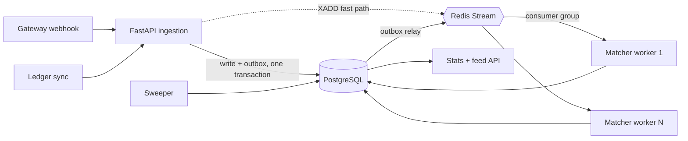

# LedgerLoop

A payment reconciliation engine. It ingests two independent transaction streams — a
payment gateway's webhook feed and a merchant's internal ledger — matches them
asynchronously, and flags every break a human needs to look at.

Every number the stats API reports is verifiable against ground truth injected by the
load generator. That is the point of the project: not that it reconciles, but that you
can prove it reconciled correctly.

---

## Live demo

| | |
|---|---|
| Dashboard | <https://ledger-loop-ivory.vercel.app> |
| API docs | <https://ledgerloop-api.onrender.com/docs> |

Both halves run on free tiers, which shapes what you will see. The API sleeps after
15 minutes with no traffic, so the first request after a quiet period pays a cold
start of roughly a minute — the dashboard pings `/health` on load to start that clock
while you are still reading the landing page. The matcher runs *inside* the API
process there (`LEDGERLOOP_EMBED_WORKER`), because Render has no free background
worker; see [Deploy](#deploy) for what that costs.

---

## The problem

A merchant's ledger and their gateway's webhook feed never agree in real time. Webhooks
arrive out of order, retry, and duplicate. Clocks drift between systems. Amounts differ
by rounding or fees. Some transactions simply never show up on one side.

Somebody has to answer, continuously: **which payments are settled, which are broken,
and how broken?** Doing it with a nightly batch job means discovering a payment gap
sixteen hours late. LedgerLoop answers it as the events arrive.

The hard part is not the matching rules. It is doing them exactly once under retries,
concurrent workers, and at-least-once message delivery.

## Architecture



Ingestion returns `202` as soon as the row is durable. Matching happens in a separate
process, so a slow match never slows down a webhook response — and the matcher scales
independently of the API.

### Why these pieces

**Redis Streams with consumer groups, not pub/sub.** Pub/sub drops messages that arrive
while no consumer is connected, which makes a worker restart a data-loss event. Streams
persist, and a consumer group gives at-least-once delivery with per-consumer
acknowledgement — so `docker compose up --scale worker=3` coordinates three matchers
with no code change and no double-processing.

**A transactional outbox, not a bare `XADD`.** Writing the row to Postgres and
publishing to Redis are two systems; without an outbox, a crash between them loses the
event silently. The API writes the row *and* the outbox record in one transaction, and a
relay drains the outbox to Redis. Redis being down degrades latency, never correctness.
The API also publishes directly as a fast path — the relay is what makes that direct
publish safe to lose.

**Effectively-once without a distributed lock.** At-least-once delivery means a message
can be processed twice. Rather than reaching for a lock, the correctness lives in a
partial unique index: at most one non-duplicate reconciliation result per raw row. Two
workers racing the same transaction both land on `ON CONFLICT DO NOTHING`, and the
second writes nothing. The database is already the arbiter of truth; a lock would add a
second one that can disagree with it.

**A separate worker process, not a background task.** An in-process task shares the
API's event loop, its memory limit, and its deploy cycle. A backlog of matching work
would degrade the ingestion path — exactly when traffic is highest.

## Matching

Five layers, each running only on what the previous one did not resolve:

| # | Layer | Rule | Outcome |
|---|-------|------|---------|
| 1 | Exact | same key + same amount + within ±2s | `matched` |
| 2 | Time drift | same key + same amount + within ±60s | `matched`, flagged `time_drift` |
| 3 | Amount drift | same key + within ±60s + amount differs ≤1% or ≤₹10 | `amount_drift`, opens an exception |
| 4 | Duplicate | same key seen twice on one side | `duplicate`, suppressed from counts |
| 5 | Unmatched sweep | unresolved after the window (default 5 min) | `unmatched_*`, opens an exception |

Two decisions worth defending:

**Time drift counts as matched.** A payment that reconciles 40 seconds late is still a
reconciled payment. Counting it as a break would make the match rate a measure of clock
synchronisation rather than of money. The `time_drift` marker is retained on the row, so
the stricter policy is a one-line change rather than a migration.

**Duplicates are excluded from the match-rate denominator.** A duplicate is the
idempotency layer doing its job, not a reconciliation failure. Including them would let a
client depress its own match rate purely by retrying.

The matching function is pure — `TxnFacts` in, `Decision` out, no I/O, no global state —
which is why it can be tested exhaustively without a database.

## API

| Method | Path | Purpose |
|--------|------|---------|
| `POST` | `/v1/gateway/webhook` | One gateway transaction. `202`, idempotent. |
| `POST` | `/v1/ledger/sync` | Up to 1000 ledger entries per request. |
| `GET` | `/v1/stats?window=1h\|24h\|7d` | Counts, match rate, p50/p95/p99, throughput. |
| `GET` | `/v1/transactions?status=&limit=&cursor=` | Cursor-paginated result feed. |
| `GET` | `/v1/exceptions?status=open\|closed` | Exception queue. |
| `POST` | `/v1/exceptions/{id}/resolve` | Close an exception with notes. |
| `GET` | `/health` `/ready` `/metrics` | Liveness, readiness, Prometheus. |

Both write endpoints are idempotent via a unique constraint plus explicit
`ON CONFLICT DO NOTHING`. A retry returns `202` with `duplicate: true` — never a `409`.
Clients retry on 5xx and network failures; answering a successful retry with an error
would make them retry the retry.

Pagination is keyset, never `OFFSET`. `OFFSET 100000` makes Postgres walk and discard
100,000 rows, so the last page of a busy queue costs the most — precisely when someone is
scrolling it.

## Local setup

Requires Docker and Docker Compose.

```bash
git clone <repo-url> && cd LedgerLoop
docker compose up -d --build
```

That brings up Postgres, Redis, migrations (one-shot), the API, and the matcher worker.

- API docs → <http://localhost:8000/docs>
- Metrics → <http://localhost:8000/metrics>

Generate traffic against it:

```bash
docker compose exec api python -m scripts.generate_load \
  --base-url=http://localhost:8000 \
  --rate=100 --duration=30 \
  --drop-rate=0.02 --duplicate-rate=0.01 --drift-rate=0.005
```

The generator prints what it injected. Compare it to `/v1/stats` — the counts must
agree. Scale the matchers and watch it still agree:

```bash
docker compose up -d --scale worker=3
```

### Backend development

```bash
cd backend
uv sync
uv run pytest                       # needs Docker: real Postgres + Redis via testcontainers
uv run ruff check . && uv run mypy .
```

Tests run against real Postgres and real Redis in containers, never SQLite or fakeredis.
`ON CONFLICT` against partial unique indexes, `FOR UPDATE SKIP LOCKED`, `percentile_cont`,
and consumer-group semantics either do not exist or behave differently in a substitute —
a green suite against a fake would prove nothing about what actually ships. Schema comes
from `alembic upgrade head`, so the tests exercise the same migration chain production
runs.

## Deploy

`render.yaml` is the blueprint this project actually runs on: Postgres, a Key Value
(Redis) instance, and one web service holding the API. Render has no free background
worker, so the matcher, relay and sweeper move onto the API's event loop via
`LEDGERLOOP_EMBED_WORKER`. That is a deployment concession, not a redesign — the loops
are the same objects driven by the same shutdown protocol, and the paid topology is one
env var plus a service block away. What it gives up is isolation: a matching backlog
now shows up as slow webhook responses.

The dashboard deploys separately to Vercel from `frontend/`, where `vercel.json`
declares the Vite build and the SPA rewrite.

### The two variables that couple the halves

Both are read at **build or boot time**, so neither can be fixed by a restart alone,
and both fail as an opaque browser network error rather than as anything legible.

| Host | Variable | Value |
|------|----------|-------|
| Vercel (build time) | `VITE_API_BASE_URL` | the API's base URL, no trailing slash |
| Render (boot time) | `LEDGERLOOP_CORS_ORIGINS` | every browser origin, comma-separated |

**`VITE_API_BASE_URL` is substituted into the bundle by `vite build`.** Setting it in
the dashboard does nothing to an existing deployment; you need a rebuild with the build
cache disabled. Left unset, the client falls back to `http://localhost:8000`
(`api/client.ts`) — and because browsers treat `localhost` as a trustworthy origin, that
request is *not* blocked as mixed content. It quietly goes to the visitor's own machine.

**`LEDGERLOOP_CORS_ORIGINS` must name the frontend's origin**, never the API's own URL —
a service never sends an `Origin` header naming itself. Setting it *replaces* the
localhost defaults rather than extending them, so list the dev origins too if you want
`npm run dev` to keep reaching the deployed API. An unlisted origin gets a bare `400`
with no `Access-Control-Allow-Origin`, which the browser surfaces only as
"NetworkError" — the request never reaches your handler, so nothing appears in the API
logs either. `api.started` logs the resolved allowlist at boot for exactly this reason.

Vercel gives every preview deployment its own hostname, which will not be on the
allowlist. Test on the production domain.

### Other hosts

Fly.io is a first-class alternative and keeps the worker as its own process:
`fly deploy` for the API (`fly.toml`) and `fly deploy -c fly.worker.toml` for the
matcher. The Fly config runs migrations as a `release_command`, which blocks the
release if they fail.

Anywhere else, the contract is the same three things: build `backend/Dockerfile`, run
`alembic upgrade head` before serving, and supply `LEDGERLOOP_`-prefixed variables. The
DSN must be `postgresql+asyncpg://` — managed providers hand out `postgresql://` (or
Heroku's older `postgres://`), and the config layer upgrades those two schemes rather
than starting on a sync driver that would block the event loop.

> **Free-tier note.** Free Postgres and Redis instances are shared and small. The
> benchmark numbers below were produced locally; free-tier throughput will be lower, and
> is bounded by the datastore, not by LedgerLoop.

## Benchmarks

See [BENCHMARKS.md](BENCHMARKS.md) for the full table, methodology, and the correctness
check at each rate.

Measured on a 4-worker API and 3 matcher containers, 30s per rate, against real
Postgres and Redis in Docker:

| offered | achieved | ingest p50 | ingest p99 | match p50 | match rate | ground truth |
|--------:|---------:|-----------:|-----------:|----------:|-----------:|:-------------|
| 100 tx/s | 99.9 | 9.3 ms | 253.9 ms | 90 ms | 0.9270 | exact on all four counts |
| 500 tx/s | 175.3 | 249.3 ms | 1,790.5 ms | 301 ms | 0.9278 | exact on all four counts |
| 1,000 tx/s | 188.4 | 233.5 ms | 1,583.4 ms | 359 ms | 0.9300 | 1 of 6,498 misclassified |

Three things this table is honest about:

**The offered rate is not achieved above ~180 tx/s, and that is the load generator, not
the engine.** A saturating `GET /health` — no database, no Redis, no matching — tops out
at 508 req/s from the same single-process asyncio client. The engine's own figure,
server-side match latency, stays flat at 90–359 ms p50 across every rate; a matcher that
were the constraint would not do that.

**Scaling the matchers is the lever, and it is measurable.** The same 100 tx/s workload
with one matcher gives a match p50 of 724 ms; with three it is 90 ms. The consumer group
needs no configuration to make that work — only `--scale worker=3`.

**Match p95/p99 are not matcher latency, and the full table says so.** Rows the
generator deliberately drops can only be resolved by the sweeper, so their measured
latency is the sweep window by construction — which is why p95/p99 sit just above
whatever that window is set to (~20 s at a 20 s window, ~90 s at 90 s). Read p50 for
matcher speed, and read the `settled` column for how long the engine needed to reach a
final answer on everything.

**The 1,000 tx/s row is marked FAIL for a single transaction.** One of 6,498 was swept
into `unmatched_gateway_only` when its counterparty was still queued behind the ingest
backlog. That is the sweeper window (set to 90 s to compress a 30 s benchmark) being
shorter than worst-case end-to-end delay at a rate the client cannot sustain anyway —
the production default is 5 minutes. Duplicates and amount drift were exact at every
rate. The harness reports it as a failure rather than rounding it away, which is the
behaviour you want from a correctness check.

## Testing

```
backend/tests/
├── test_matching_*.py           exhaustive per-layer rules
├── test_api_ingest.py           idempotency, batch limits, validation
├── test_api_read.py             stats, keyset pagination, feed enrichment, CORS
├── test_worker_concurrency.py   two workers, one stream, no double-processing
├── test_sweeper.py              the unmatched window
└── test_e2e.py                  real server, real worker, end to end
```

The tests that matter most are the boring-sounding ones: posting the same webhook twice
produces one row, and two workers consuming the same stream produce one result per
transaction. Those are the claims the architecture makes, so those are the ones with
tests that would fail loudly if the claim broke.

## Project layout

```
backend/
  ledgerloop/
    api/            FastAPI app, routes, request/response models
    db/             SQLAlchemy models, enums, session management
    matching/       pure matching logic — no I/O, no globals
    queue/          Redis Streams client, outbox relay
    services/       ingestion and read-path queries
    worker/         matcher loop, persistence, sweeper
    observability/  structured logging, Prometheus metrics
  scripts/          load generator, benchmark harness
  tests/

frontend/
  src/
    api/            HTTP client, ingestion pacing, generated API types
    screens/        landing, upload/mapping, reconcile, dashboard
    components/     table, layer cascade, exception detail
    lib/            CSV parsing, money handling, synthetic data generator
```

The dashboard is a pure client: it posts both sides through the API and renders what
the API returns. There is no matching engine in the browser — the five layers exist
once, in `backend/ledgerloop/matching/`.
